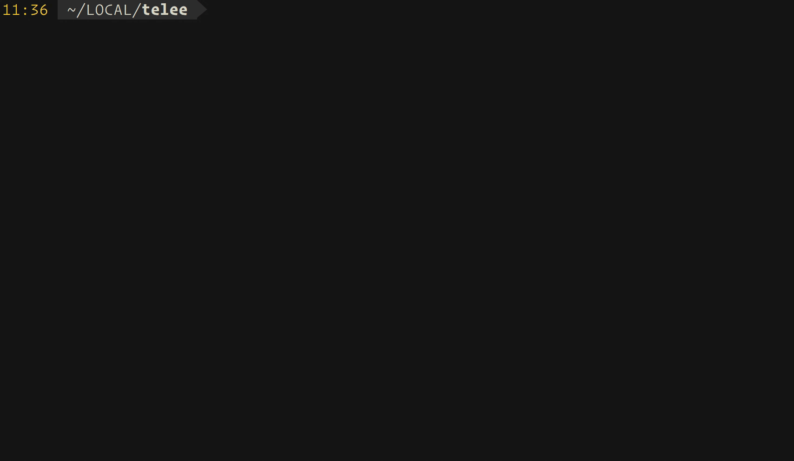

<div align="center">

  <picture>
    <source media="(prefers-color-scheme: dark)" srcset="https://raw.githubusercontent.com/umatare5/telee/main/docs/assets/logo_dark.png" width="115px" />
    <source media="(prefers-color-scheme: light)" srcset="https://raw.githubusercontent.com/umatare5/telee/main/docs/assets/logo.png" width="115px" />
    
  </picture>

  <h1>telee</h1>

  <p>A command-line interface that logs in to one network device and runs commands on it.</p>

  <p>
    
    <a href="https://github.com/umatare5/telee/actions/workflows/go-test-build.yml"></a>
    <br/>
    <a href="https://www.bestpractices.dev/projects/10968"></a>
    <a href="./LICENSE"></a>
    <a href="https://developer.cisco.com/codeexchange/github/repo/umatare5/telee"></a>
  </p>

</div>

## Overview

This CLI opens a telnet or SSH session, logs in, turns off paging, runs each command and prints the output.

- ⚡ **One-Line Execution**: Runs every `-C` in one session instead of `expect` or TeraTerm macros
- 🧭 **Vendor Dialects**: Handles login, paging and enable steps per OS, from Cisco IOS to YAMAHA RT
- 🔐 **Dual Transport**: Uses telnet for legacy devices and SSH with host key checks for the rest
- 💻️ **Shell Friendly**: Puts only device output on stdout, so pipes and redirects need no filtering

<div align="center">
  
</div>

## Supported Environment

A network device on a platform under [Exec Platform](#exec-platform), reached over telnet or SSH as that platform allows.

## Installation

This CLI supports container images and OS-specific binaries.

```bash
docker pull ghcr.io/umatare5/telee
```

Or, download the binaries from [Releases](https://github.com/umatare5/telee/releases). `(linux|darwin)_(amd64|arm64)` are supported.

## Quick Start

### 1. Set the environment variables

```bash
export TELEE_USERNAME="admin"
read -rs TELEE_PASSWORD && export TELEE_PASSWORD # < user-password
read -rs TELEE_PRIVPASSWORD && export TELEE_PRIVPASSWORD # < enable-password
```

### 2. Run a command

```console
$ telee --hostname lab1-cat29l-02f99-01 --command "show int descr"
lab1-cat29l-02f99-01>show int descr
Load for five secs: 2%/0%; one minute: 1%; five minutes: 1%
Time source is NTP, 23:16:54.302 JST Sat May 8 2021

Interface                      Status         Protocol Description
Vl1                            admin down     down
Vl800                          up             up       *** LAB-MGMT ***
Gi0/1                          up             up       CLIENT_DEVICE_LONG_DESCR
Gi0/2                          up             up       CLIENT_DEVICE
Gi0/3                          up             up       CLIENT_DEVICE
Gi0/4                          up             up       CLIENT_DEVICE
Gi0/5                          up             up       CLIENT_DEVICE
Gi0/6                          down           down     CLIENT_DEVICE
Gi0/7                          down           down     CLIENT_DEVICE
Gi0/8                          up             up       GATEWAY_ROUTER
Gi0/9                          admin down     down
Gi0/10                         admin down     down
lab1-cat29l-02f99-01>
```

### 3. Pipe or redirect the output

```console
$ telee --hostname lab1-cat29l-02f99-01 --command "show int descr" | grep "Interface\|down"
Interface                      Status         Protocol Description
Vl1                            admin down     down
Gi0/1                          down           down     CLIENT_DEVICE_LONG_DESCR
Gi0/6                          down           down     CLIENT_DEVICE
Gi0/7                          down           down     CLIENT_DEVICE
Gi0/9                          admin down     down
Gi0/10                         admin down     down
```

```console
$ telee --hostname lab1-cat29l-02f99-01 --command "show run" --enable > telee.log
$ head -n 10 telee.log
lab1-cat29l-02f99-01#show run
Load for five secs: 1%/0%; one minute: 1%; five minutes: 1%
Time source is NTP, 23:21:34.501 JST Sat May 8 2021

Building configuration...

Current configuration : 18687 bytes
!
! Last configuration change at 01:30:16 JST Sun Feb 14 2021
!
```

## CLI Reference

This CLI has no subcommands, and the flags below run one or more commands on one device:

```text
NAME:
   telee - One-line command executor

USAGE:
   telee -H HOSTNAME -C COMMAND [-C COMMAND...] [options...]

VERSION:
   dev

GLOBAL OPTIONS:
   --hostname string, -H string                                 Set hostname or IP address. [$TELEE_HOSTNAME]
   --port int, -P int                                           Set port number. (default: 0)
   --timeout int, -t int                                        Set timeout seconds. (default: 5)
   --command string, -C string [ --command string, -C string ]  Set a command. Repeat it to run more in the same session. [$TELEE_COMMAND]
   --exec-platform string, -x string                            Set exec-platform. Refer to README.md what to be set. (default: "ios")
   --enable-mode, -e, --ena, --enable                           Raise to privileged EXEC mode.
   --redundant-mode, -r, --redundant                            Use redundant prompt mode.
   --secure-mode, -s, --sec, --secure                           Use ssh mode.
   --default-privilege-mode, -d                                 Use default privileged mode assinged by RADIUS attribute.
   --username string, -u string                                 Set username. (default: "admin") [$TELEE_USERNAME]
   --password string, -p string                                 Set password. [$TELEE_PASSWORD]
   --priv-password string, --pp string                          Set password to raise to privileged EXEC mode. [$TELEE_PRIVPASSWORD]
   --host-key-path string, --hkp string                         Set path to host key file for SSH host key verification. [$TELEE_HOSTKEYPATH]
   --help, -h                                                   show help
   --version, -v                                                print the version
```

## Customization

This CLI reads its settings from flags and environment variables, and a flag takes precedence over its variable.

| Variable             | Description                              |
| :------------------- | :--------------------------------------- |
| `TELEE_HOSTNAME`     | Hostname or IP address, as `--hostname`  |
| `TELEE_COMMAND`      | One command, as `--command`              |
| `TELEE_USERNAME`     | Login username, as `--username`          |
| `TELEE_PASSWORD`     | Login password, as `--password`          |
| `TELEE_PRIVPASSWORD` | Enable password, as `--priv-password`    |
| `TELEE_HOSTKEYPATH`  | Host key file path, as `--host-key-path` |

## Usage

The usage below adds the flag each case beyond the Quick Start needs.

<details><summary>SSH – <code>--secure-mode</code></summary><p>

```console
$ telee -H lab1-cat29l-02f99-01 -C "show run" --enable --secure
lab1-cat29l-02f99-01#show run
Load for five secs: 8%/0%; one minute: 2%; five minutes: 1%
Time source is NTP, 02:25:22.496 JST Fri May 14 2021

Building configuration...

Current configuration : 18716 bytes
!
! Last configuration change at 01:46:41 JST Fri May 14 2021 by raciadev
!
version 15.2
no service pad
service tcp-keepalives-in
service timestamps debug datetime msec localtime show-timezone
service timestamps log datetime msec localtime show-timezone
service password-encryption
!
hostname lab1-cat29l-02f99-01
<snip>
```

</p></details>

<details><summary>Several commands in one session – <code>--command</code></summary><p>

```console
$ telee --hostname lab2-cat29c-06f-01 --command "show version" --command "show inventory"
lab2-cat29c-06f-01>show version
Cisco IOS Software, C2960CX Software (C2960CX-UNIVERSALK9-M), Version 15.2(7)E3, RELEASE SOFTWARE (fc3)
<snip>
lab2-cat29c-06f-01>show inventory
NAME: "1", DESCR: "WS-C2960CX-8PC-L"
PID: WS-C2960CX-8PC-L  , VID: V03  , SN: FOC0000X0XX


lab2-cat29c-06f-01>
```

</p></details>

<details><summary>A platform other than IOS – <code>--exec-platform</code></summary><p>

```console
$ telee -H 192.168.0.250 -C "show sysinfo" -x aireos
(Cisco Controller) >show sysinfo

Manufacturer's Name.............................. Cisco Systems Inc.
Product Name..................................... Cisco Controller
Product Version.................................. 8.5.120.0
Bootloader Version............................... 1.0.20
Field Recovery Image Version..................... 7.6.101.1
Firmware Version................................. PIC 19.0

OUI File Last Update Time........................ Sun Sep 07 10:44:07 IST 2014

Build Type....................................... DATA + WPS

System Name...................................... lab1-wlc-01f01-01a
System Location..................................
System Contact...................................
System ObjectID.................................. 1.3.6.1.4.1.9.1.1279
IP Address....................................... 192.168.0.250
<snip>
```

</p></details>

<details><summary>Privilege granted by RADIUS – <code>--default-privilege-mode</code></summary><p>

```console
$ telee -H lab1-nx70-02f01-01 -C "show version" -x nxos --default-privilege-mode
lab1-nx70-02f01-01# show version
Cisco Nexus Operating System (NX-OS) Software
TAC support: http://www.cisco.com/tac
Documents: http://www.cisco.com/en/US/products/ps9372/tsd_products_support_series_home.html
Copyright (c) 2002-2015, Cisco Systems, Inc. All rights reserved.
The copyrights to certain works contained in this software are
owned by other third parties and used and distributed under
license. Certain components of this software are licensed under
the GNU General Public License (GPL) version 2.0 or the GNU
Lesser General Public License (LGPL) Version 2.1. A copy of each
such license is available at
http://www.opensource.org/licenses/gpl-2.0.php and
http://www.opensource.org/licenses/lgpl-2.1.php

Software
BIOS:      version N/A
kickstart: version 6.2(14)
system:    version 6.2(14)
BIOS compile time:
kickstart image file is: bootflash:///n7000-s1-kickstart.6.2.14.bin
<snip>
```

</p></details>

<details><summary>ASA, whose paging command needs privilege – <code>--enable-mode</code></summary><p>

```console
$ telee -H lab1-asa5505-02f01-01 -C "show version" -x asa --enable-mode --pp enable-password
lab1-asa5505-02f01-01#show version

Cisco Adaptive Security Appliance Software Version 9.0(4)
Device Manager Version 7.1(5)100

Compiled on Wed 04-Dec-13 08:33 by builders
System image file is "disk0:/asa904-k8.bin"
Config file at boot was "startup-config"

lab1-asa5505-02f01-01 up 70 days 2 hours

Hardware:   ASA5505, 512 MB RAM, CPU Geode 500 MHz,
Internal ATA Compact Flash, 128MB
BIOS Flash M50FW016 @ 0xfff00000, 2048KB

Encryption hardware device : Cisco ASA-5505 on-board accelerator (revision 0x0)
                             Boot microcode        : CN1000-MC-BOOT-2.00
                             SSL/IKE microcode     : CNLite-MC-SSLm-PLUS-2.03
<snip>
```

</p></details>

<details><summary>A slow legacy device – <code>--timeout</code></summary><p>

```console
$ telee -H lab1-fs909-02f01-01 -C "show system" -x allied -u manager --timeout 10
Manager lab1-fs909-02f01-01>show system
Switch System Status                     Date 2021-05-09 Time 01:04:54
Board     Bay      Board Name
----------------------------------------------------------------------
Base      -        FS909M
----------------------------------------------------------------------
Memory -  DRAM : 32768 kB  FLASH : 8192 kB   MAC : 00-1A-EB-93-1C-95
----------------------------------------------------------------------
SysDescription  : CentreCOM FS909M Ver 1.6.14 B02
SysContact      :
SysLocation     : LAB
SysName         : lab1-fs909-02f01-01
SysUpTime       : 1267989237(146days, 18:11:32)
Release Version : 1.6.14
Release built   : B02 (Nov 23 2010 at 14:29:56)
Flash PROM      : Good
RAM             : Good
SW chip         : Good
<snip>
```

</p></details>

> [!TIP]
> [umatare5/my-infra-network](https://github.com/umatare5/my-infra-network) calls this CLI from shell scripts to collect device state and save configurations.

## Exec Platform

The tables below list the modes each platform accepts, and the OS version each path was verified on.

- telee works for several operating systems. These are called exec-platform.
- The following table shows each exec-platform was verified on which OS version.

### Matrix

Each platform accepts the modes below.

| Name (`-x`) | Description              | Enable Mode (`-e`) | Redundant Mode (`-r`) |
| :---------- | :----------------------- | ------------------ | --------------------- |
| `aireos`    | Cisco AireOS             | Optional           | Not Available         |
| `allied`    | AlliedTelesis AlliedWare | Not Available      | Not Available         |
| `asa`       | Cisco ASA Software       | **REQUIRED**       | Optional              |
| `foundry`   | Brocade IronWare         | Optional           | Not Available         |
| `ios`       | Cisco IOS, IOS-XE        | Optional           | Not Available         |
| `nxos`      | Cisco NX-OS              | Optional           | Not Available         |
| `srx`       | JuniperNetworks JunOS    | Not Available      | Not Available         |
| `ssg`       | JuniperNetworks ScreenOS | Not Available      | Optional              |
| `yamaha`    | YAMAHA RT OS             | Optional           | Not Available         |

### Verified On

Each path was verified on the OS version below.

| Name (`-x`)            | Telnet          | SSH (`--secure`) | Default PrivMode (`-d`) |
| :--------------------- | :-------------- | :--------------- | ----------------------- |
| `aireos`               | ✅ 8.5.120.0    | ✅ 8.5.120.0     | Not Supported           |
| `allied`               | ✅ 1.6.14B02    | Not Supported    | Not Supported           |
| `asa`                  | ✅ 9.0(4)       | ⚠ Not Verified   | ⚠ Not Verified          |
| `asa` (redundant-mode) | ✅ 9.10(1)      | ⚠ Not Verified   | ⚠ Not Verified          |
| `foundry`              | ✅ 07.2.02aT7e1 | Not Supported    | Not Supported           |
| `ios`                  | ✅ 15.2(7)E3    | ✅ 15.2(7)E3     | ✅ 15.2(5c)E            |
| `nxos`                 | ✅ 6.2(14)      | ⚠ Not Verified   | ✅ 6.2(14)              |
| `srx`                  | Not Supported   | ✅ 15.1X49-D90.7 | Not Supported           |
| `ssg`                  | ✅ 6.3.0r21.0   | ⚠ Not Verified   | Not Supported           |
| `ssg` (redundant-mode) | ✅ 6.3.0r22.0   | ⚠ Not Verified   | Not Supported           |
| `yamaha`               | ✅ Rev.8.03.94  | ✅ Rev.10.01.78  | Not Supported           |

> [!NOTE]
> "⚠ Not Verified" means "implemented but not checked". I'm waiting your report!

## Documentation

Troubleshooting is written for an operator, and the other two pages for a contributor.

- **[Troubleshooting](docs/troubleshooting.md)** – every error message this CLI prints, and what each one means
- **[Architecture](docs/architecture.md)** – the output contract and the exit codes
- **[Measurements](docs/measurements.md)** – every timing taken against the lab switch, and its scripts

## Contributing

See [`CONTRIBUTING.md`](CONTRIBUTING.md) for the development setup, the test conventions and the release steps.

## License

MIT. The binary statically links MIT, BSD 3-Clause and Apache 2.0 dependencies, whose notices are reproduced in [`NOTICE`](NOTICE) and shipped alongside [`LICENSE`](LICENSE) in every release archive and container image.
